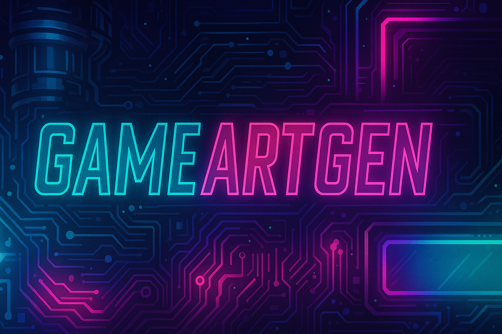

# 🎮 GameArtGen – AI-Powered Game Asset Generator

GameArtGen is a Generative AI app that lets game developers create stunning 2D assets like characters, items, and backgrounds using Stable Diffusion.

🚀 Built with:
- Python + Streamlit
- Hugging Face Inference API (Stable Diffusion)
- Smart Prompt Templates by Category
- Image Gallery + Downloads

---

## 💡 Features

- 🎯 Auto-suggests smart prompts by asset type (character, item, etc.)
- 🧠 Uses Hugging Face Stable Diffusion API
- 🎨 Styles include pixel, cartoon, realistic, cyberpunk
- 💾 Image download + asset history
- ⚡ Fast UI built in Streamlit

---

## 🖼️ Sample Output



---

## 🛠️ How to Run Locally

```bash
git clone https://github.com/YOUR_USERNAME/gameartgen.git
cd gameartgen
pip install -r requirements.txt
streamlit run app.py
